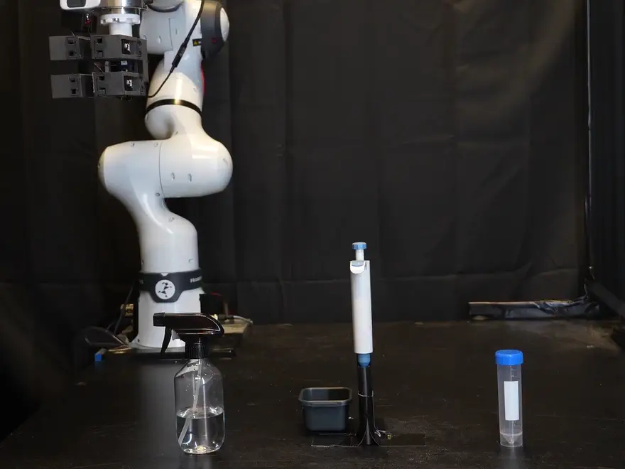
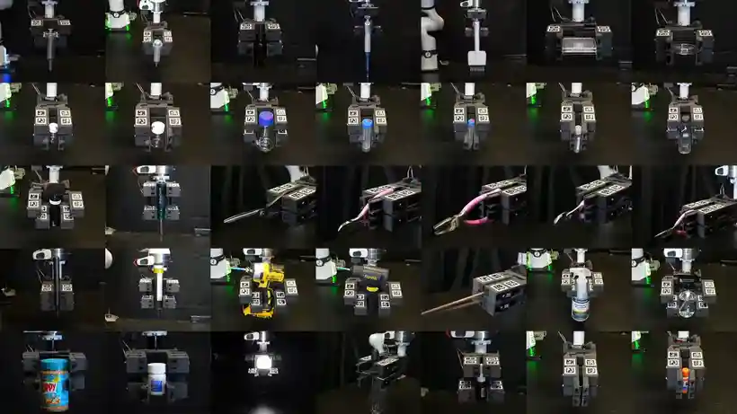
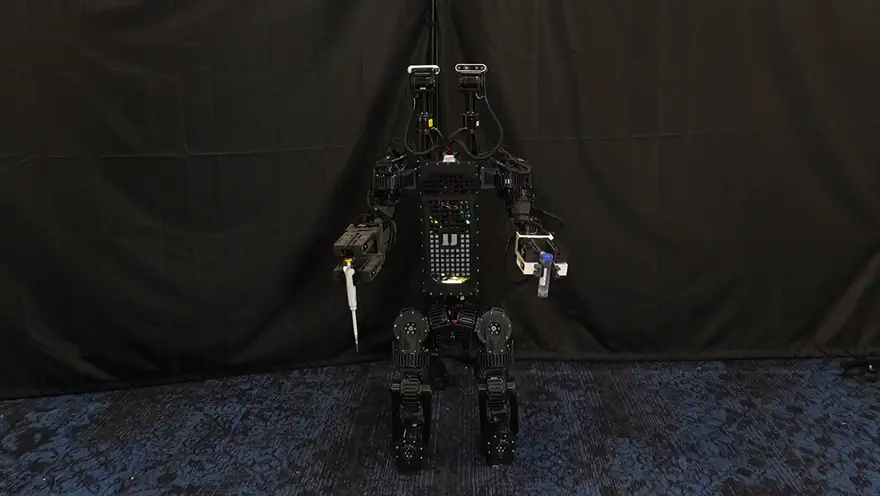
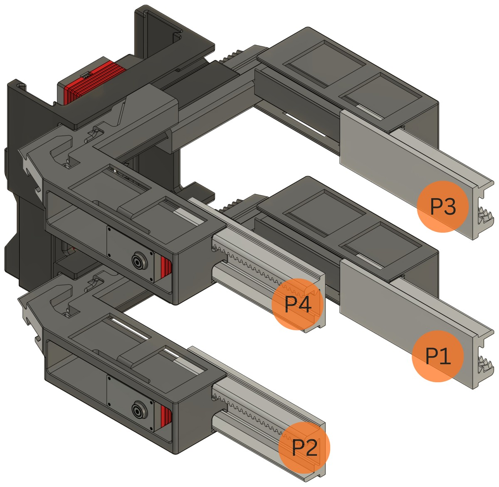
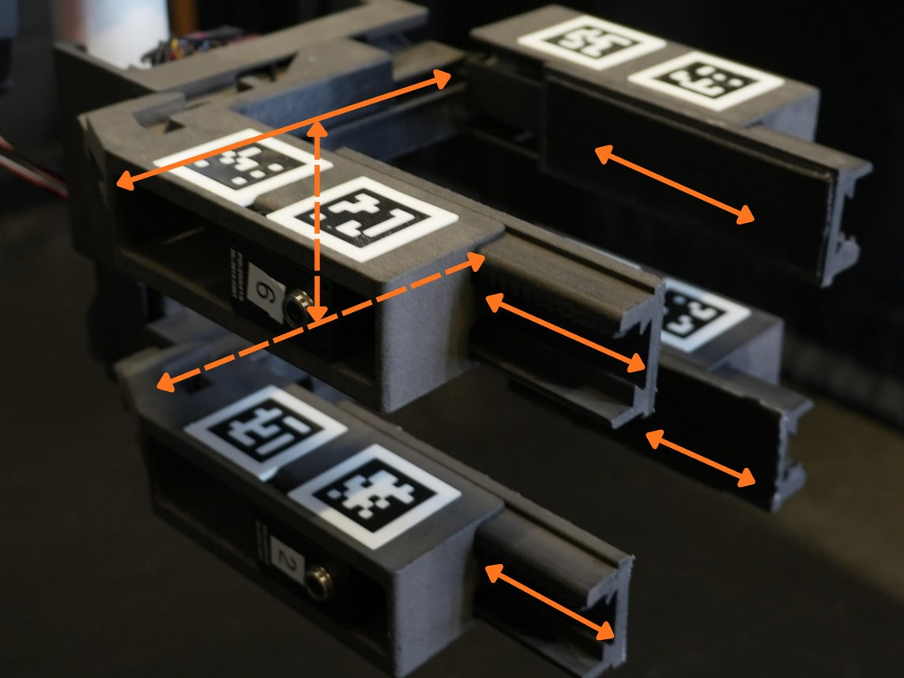

# The Cartesian Hand

**In-hand manipulation with all-linear fingers.**

Boxi Xia†, Bokuan Li†, Ryan Shin, Zijiang Yang, Jiaxun Liu,
[Boyuan Chen](http://boyuanchen.com/)

Duke University, [General Robotics Lab](https://generalroboticslab.com/).
† equal contribution, co-first authors.

### [Project page](https://generalroboticslab.com/cartesian_handv1) with full-length video of every object

<div align="left">
  
</div>

Two parallel grippers hold different parts of an object. Four translating
fingertips move those parts relative to each other. Every joint slides in a
straight line, so a fingertip travels along a fixed axis in any configuration and
the hand has no singular poses.

This repository is the control stack: task authoring, the tensor engine that runs
a task, and three backends that execute it on servos, on CPU MuJoCo, or on
batched GPU MuJoCo.

## Objects

<div align="left">
  
</div>

35 objects, across laboratory, manufacturing and household settings. Objects that
share a mechanism share a procedure: a new object keeps the sequence, the
controller and the hand, and changes a few settings such as grasp height, stroke
and force limit.

| Mechanism | `--task` | n |
|---|---|--:|
| Cap | `cap` | 15 |
| Two-handle | `scissors` | 6 |
| Trigger | `triggers` | 5 |
| Pump | `pump`, `syringe` | 3 |
| Screwdriver | `screwdriver` | 3 |
| Pipette | `pipette` | 2 |
| Reorientation | `tilt` | 1 |

> **Read that as object coverage, not as this repository's test results.** The
> sequences were validated on an earlier internal implementation that is not
> included here. The task files in `cartesian_hand/tasks/` are transcriptions of
> them and have not been re-run on the objects. See [Status](#status).

The same procedures transfer to a humanoid. With a hand on each arm, one hand
opens a centrifuge tube while the other pipettes into it. Only the approach and
grasp pose change.

<div align="left">
  
</div>

## The hand

<div align="left">
  
</div>

Four actuated fingertips, P1 to P4. P1 and P2 belong to the base gripper, P3 and
P4 to the auxiliary gripper, and the auxiliary gripper rides the vertical stage.

| | |
|---|---|
| Joint speed | ~ 60 mm/s |
| Static hold, one gripper | 2 kg |
| Mass | 850 g |
| Size | ~ 166 x 100 x 76 mm |
| Structure | 3D-printed PLA or nylon |
| Cost | ~ $500 |

Travel does not appear in the table. Five numbers are in circulation and none
has been checked with a caliper. What the software enforces is
`config.STANDARD_TRAVEL`: 55 mm on the fingers, 50 mm on the jaws and the z
stage. Read [Known issues](docs/hardware.md#known-issues) before driving any
DOF to a limit.

## Overview

A controller opens no serial port, never sleeps, and steps no simulator. It sees
typed observations in millimetres and returns commands. The executor alone owns
I/O and pacing.

```text
tasks.make(name) ─┬─ Policy ─ PolicyRunner ─┬─ studio.live   servos + viser
                  └─ Task ─── TaskRunner ───┼─ sim.run       CPU MuJoCo
                                            └─ sim.run_warp  batched GPU MuJoCo
```

Two controller forms share that pipeline:

- `Policy.step` is the target for closed-loop manipulation. It runs every tick,
  keeps tensor state, composes reusable primitives, and is batch-friendly.
- `Motions` and `TaskRunner` execute fixed `[N,J,K]` programs, still used for
  zeroing and GUI-authored timelines.

## Requirements

- Linux (developed on Ubuntu; serial paths assume `/dev/tty*`)
- Python 3.8+
- CMake 3.15+ and a C++17 compiler, to build the servo extension
- Hardware is optional. Everything below runs against `--mock` or MuJoCo.

## Installation

```bash
git clone --recurse-submodules https://github.com/generalroboticslab/Cartesian_Hand.git
cd Cartesian_Hand
pip install -e ".[sim,studio]"
```

`torch` is a core dependency. The extras are optional: `sim` pulls MuJoCo,
`studio` pulls viser for the browser page, `camera` pulls OpenCV for the
studio's camera window, and `serial` pulls pyserial for the pure-Python servo
driver. The batched GPU path additionally needs `warp` and `mujoco_warp`, which
are not declared because they are not on PyPI under stable names.

Already cloned without `--recurse-submodules`? Run
`git submodule update --init --recursive`. The build compiles the nanobind
extension (`ft_servo_ext`) around the C++ driver in that submodule, so the init
is not optional.

To read the code, write a task, or run everything in simulation, skip the build.
`servo.open_driver` imports the extension inside the call rather than at module
scope, so importing this package never touches hardware.

## Quick start

```bash
# hardware
python -m cartesian_hand.studio                          # browser page at :8081
python -m cartesian_hand.studio --hand hand_1            # skip the ID probe
python -m cartesian_hand.studio --task zero              # zero it, headless
python -m cartesian_hand.studio --mock --seconds 5       # no hardware attached
python -m cartesian_hand.studio --teach                  # limp, pose it by hand

# simulation, same task files (object-free tasks only for now)
python -m cartesian_hand.sim --task zero
python -m cartesian_hand.sim --task zero --n-envs 4096 --warp   # GPU, batched
```

> **Zero the hand before trusting a millimetre.** Without a calibration, zero
> is the *startup pose*. The travel clamp still applies, but relative to
> wherever the hand happened to be, so starting mid-travel and driving a full
> stroke can still run a carriage off its rail.
> See [Zeroing](docs/hardware.md#zeroing).

No hardware on the bench? Start with `--mock`, and redirect
`CARTESIAN_HAND_CALIB` first. A mock run otherwise overwrites a real hand's
calibration. See
[Running without hardware](docs/internals.md#running-without-hardware).

Simulation uses the MuJoCo model bundled at `assets/cartesian_hand/`, so no
external checkout is needed. Every entry point is
[tyro](https://brentyi.github.io/tyro/) over a function signature, so `--help`
lists the real flags.

## The seven DOFs

<div align="left">
  
</div>

Each gripper is a parallel jaw plus two independent finger slides, and the stage
carries the auxiliary gripper up and down. Every DOF is linear and commanded in
millimetres from the hard stop that zeroing finds.

| DOF | Role | Axis | Orient | What it does | Servo `hand_1` / `hand_2` |
|----:|------|:----:|:------:|--------------|:-------------------------:|
| 0 | `BASE_JAW` | y | −1 | base parallel actuation | 0 / 7 |
| 1 | `BASE_LEFT` | x | −1 | base left finger | 1 / 8 |
| 2 | `BASE_RIGHT` | x | −1 | base right finger | 2 / 9 |
| 3 | `Z` | z | −1 | vertical translation | 3 / 10 |
| 4 | `AUX_JAW` | y | −1 | aux parallel actuation | 4 / 11 |
| 5 | `AUX_LEFT` | x | −1 | aux left finger | 5 / 12 |
| 6 | `AUX_RIGHT` | x | −1 | aux right finger | 6 / 13 |

That index is also the index of the joint vector `q`, so the fingertip positions
fall straight out of it:

```text
P1 = [q1, −q0,  0]      P3 = [q5, −q4, q3]
P2 = [q2,  q0,  0]      P4 = [q6,  q4, q3]
```

Each fingertip is a fixed linear function of the joints, so the Jacobian is a
constant `12 × 7` matrix of rank 7. That is what lets a manipulation be composed
from linear primitives, and why `primitives.py` never solves an IK problem.

Three things the table hides: DOF index is not servo ID, what `orientation` can
and cannot fix, and why the ordering is authoritative for the simulation. They
are in [DOF indexing and orientation](docs/hardware.md#dof-indexing-and-orientation).

## Documentation

| | |
|---|---|
| [docs/tasks.md](docs/tasks.md) | Writing a task, how a `--task` name reaches a file, the direct policy path, and the studio's compose and tune panels |
| [docs/internals.md](docs/internals.md) | The `[N,J,K]` engine, the closed-loop primitives, and the three execution backends |
| [docs/hardware.md](docs/hardware.md) | Zeroing, `HandConfig`, motion gains, servo setup, measured hardware status, and known issues |

## Project structure

```
cartesian_hand/
  config.py      tunables, then the types, then the hands. Pure description:
                 no port, no threads, no I/O beyond JSON, so a twin can import it
  motions.py     the engine (Motions, Move, Program) plus TaskRunner
  policy.py      typed Observation, Action, Policy protocol, and PolicyRunner
  primitives.py  the tilt Step helper plus the direct closed-loop primitives,
                 the rows, and the Sequence that walks them
  tasks/         one file per task; the file stem is the --task name
    zero.py         find every hard stop, report it as the hand's zero
    ready.py        send every DOF to mid travel; the studio's Reset button
    cap.py          probe, strokes, extract, re-thread. A bottle cap
    screwdriver.py  turn a screwdriver either way; cw presses z
    pipette.py      twist-lock knob, then plunge and draw
    syringe.py      clamp the body, draw the plunger, dispense
    scissors.py     two-handle tool; z travel is the pivot
    tilt.py         grip with both stages, pitch the object
  compose.py     writes a task file from a row list. Imports no GUI, so the
                 dependency runs studio -> compose -> tasks and never back
  studio.py      the hardware backend: live loop plus the viser page
  sim.py         the MuJoCo backend
  mjcf.py        model path and the DOF-to-joint map
  servo.py       the serial bus, and MockServo for offline runs
tests/           test_trace.py and its recorded traces.json
hardware_bindings/      submodule: IMU, motor and servo bindings
assets/cartesian_hand/  the sim model, generated and bundled
media/                  figures and clips used by this README
```

## Tests

```bash
python tests/test_trace.py            # check against the recorded traces
python tests/test_trace.py --update   # re-record after an intended change
```

One golden-trace check, no framework. It runs all eight tasks against a toy
plant in millimetres and hashes every goal and every effort they command. What
it can and cannot catch is stated exactly in
[docs/hardware.md](docs/hardware.md#test-suite). In particular, do not read a
pass as evidence about grip force.

## Status

This repository is the control stack, rewritten. It is not the code that
produced the object results above, and the difference matters if you are
deciding what to trust.

Working on hardware: all seven servos enumerate, the loop holds 50 Hz with zero
drops, and a 5 mm goal tracks to 0.01 mm of error.

Not established here: no manipulation task in `cartesian_hand/tasks/` has
completed on its physical object. Total travel is CAD rather than measured, and
`counts_per_mm` has never been checked against a measured distance.

Full measurements are in
[Hardware status](docs/hardware.md#hardware-status); each gap has an entry under
[Known issues](docs/hardware.md#known-issues). Read the travel one before
driving a hand to a limit. The far end of every rail is open, and a carriage
that passes it leaves its slider.

## Citation

```bibtex
@article{xia2026cartesianhand,
  title   = {The Cartesian Hand: In-Hand Manipulation with All-Linear Fingers},
  author  = {Xia, Boxi and Li, Bokuan and Shin, Ryan and Yang, Zijiang
             and Liu, Jiaxun and Chen, Boyuan},
  year    = {2026},
  url     = {https://generalroboticslab.com/cartesian_handv1}
}
```

## Acknowledgements

Supported by DARPA FoundSci under award HR00112490372, DARPA TIAMAT under award
HR00112490419, ARO under award W911NF2410405, and ARL STRONG under awards
W911NF2320182, W911NF2220113 and W911NF242021.

## License

Apache License 2.0. See [LICENSE](LICENSE).
