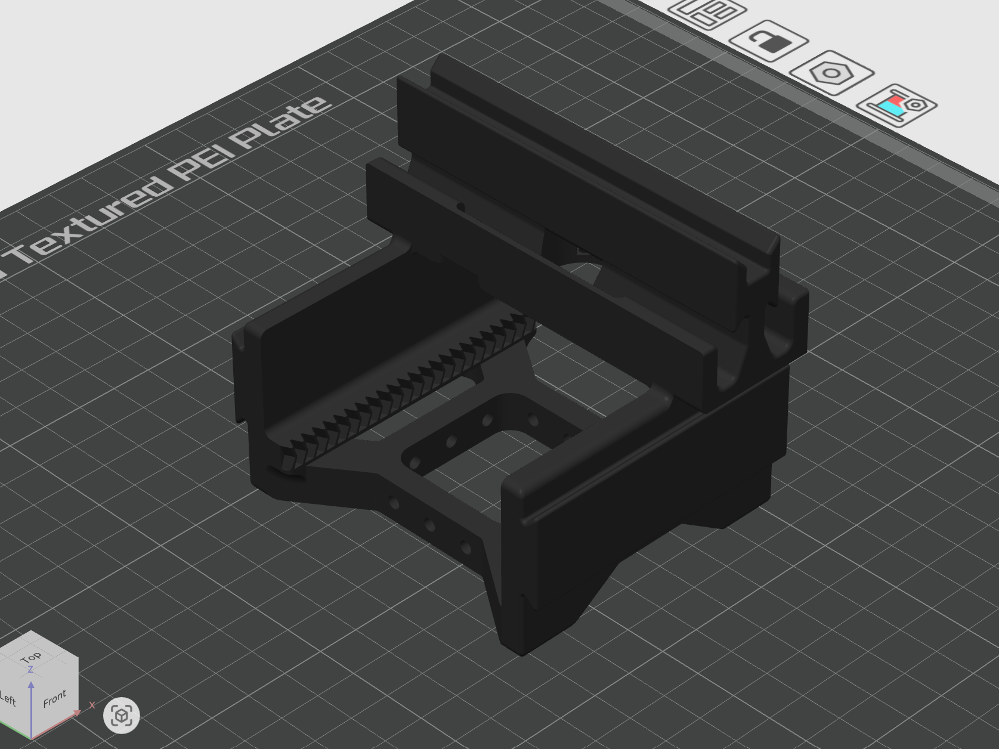
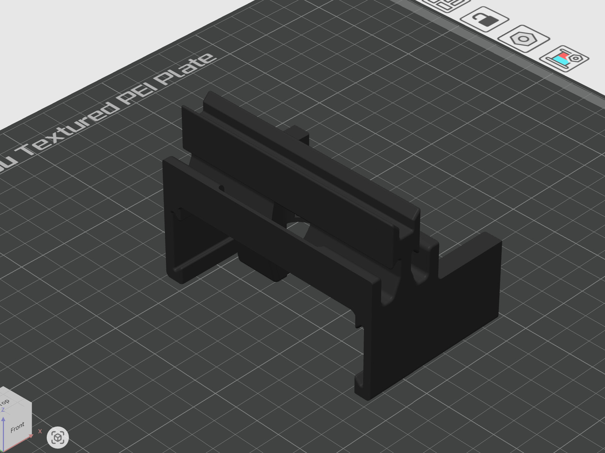
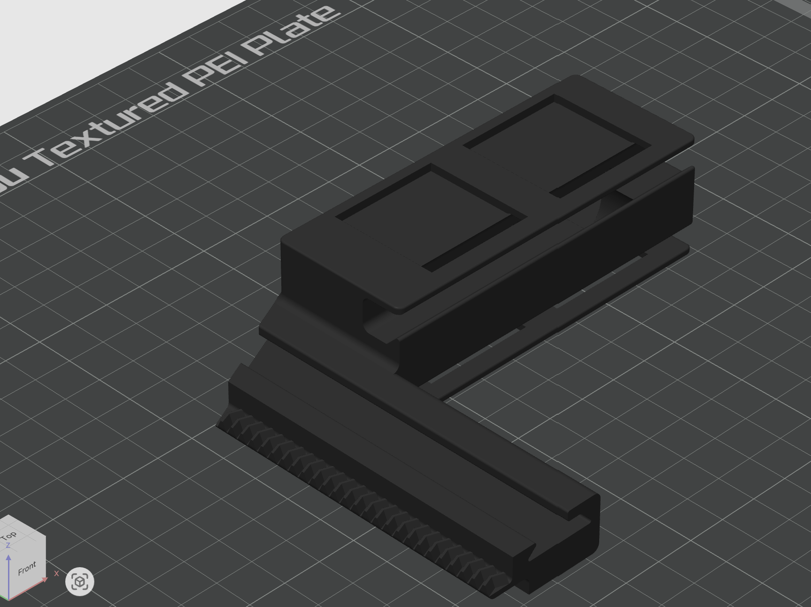
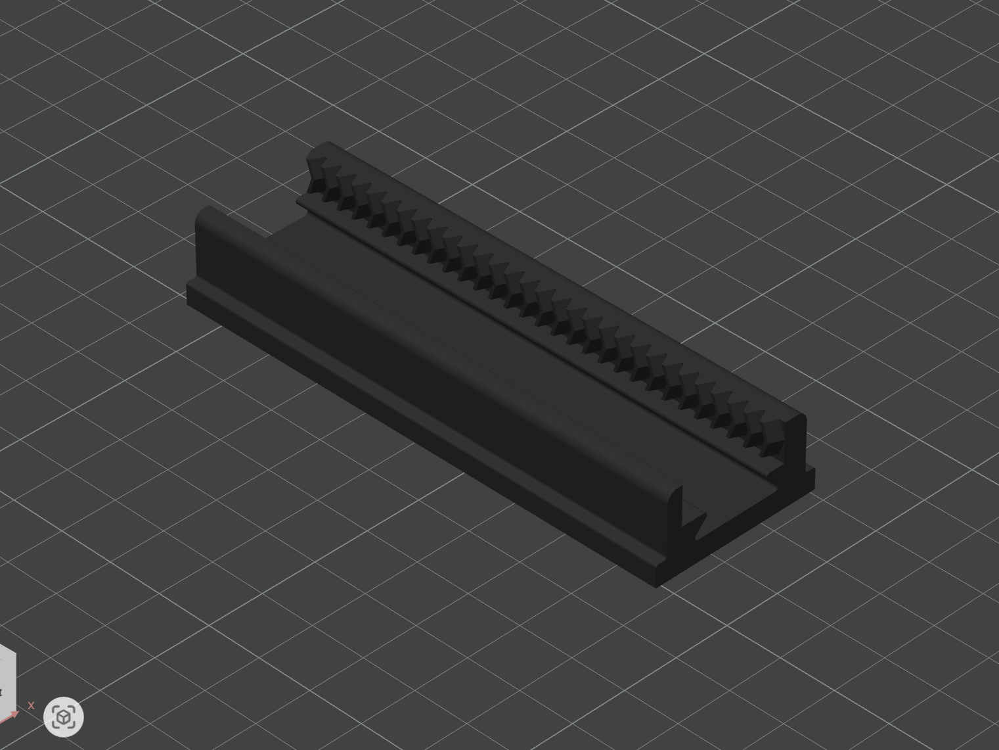
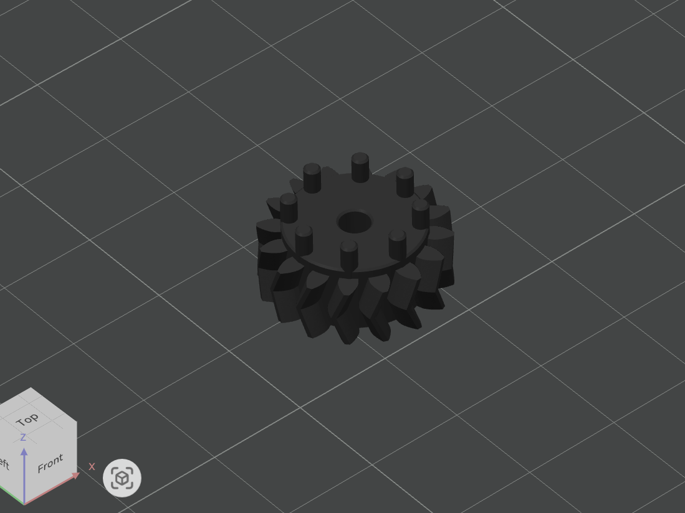
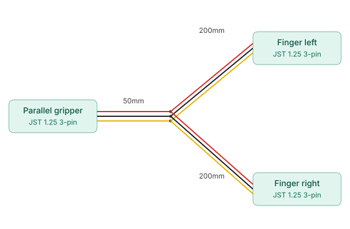
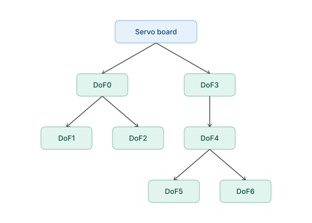

# Cartesian Hand

A 4-finger cartesian gripper driven by seven Feetech HLS3915M serial bus servos. This page lists everything needed to build it.

<!-- Add a hero photo/video here:  -->

## Bill of Materials

### Electronics

| Qty | Part | Notes | Link |
|----:|------|-------|------|
| 1 | Serial bus servo driver board | Controls all servos over one bus | [Amazon](https://www.amazon.com/Serial-Integrates-Control-Circuit-Supports/dp/B0D1R4SGFS) |
| 7 | Feetech HLS3915M servo | Sold as 2-packs (buy 4 packs, 1 spare). Each servo includes a 150mm JST cable | [Amazon](https://www.amazon.com/2-Pack-Feetech-HLS3915M-Dual-Shaft-Coreless/dp/B0GVY2Y3C9) |
| 1 | Pre-made JST 1.25mm 3-pin wires, 200mm (pack) | Used for the Y-splice cables (6 wires needed) | [Amazon](https://www.amazon.com/dp/B0FS155VV6) |
| 1 | Heat shrink tubing assortment | For insulating the Y-splice joints | [Amazon](https://www.amazon.com/Eventronic-Heat-Shrink-Tubing-Kit-3/dp/B0BVVMCY86) |

### Hardware and Materials

| Qty | Part | Notes | Link |
|----:|------|-------|------|
| 1 | Bambu PLA Basic filament | All printed parts | [Bambu](https://us.store.bambulab.com/products/pla-basic-filament?id=40988815556744) |
| 1 | Bambu Support for PLA filament | Support interface layer only | [Bambu](https://us.store.bambulab.com/products/support-for-pla-new) |
| 20 | M2 x 6 mm screw | | [Amazon (assortment kit)](https://www.amazon.com/Fgruh-1200PCS-Assortment-Washers-Assorted/dp/B0FGV5K8BT) |
| 7 | M2.5 x 10 mm screw | | [Amazon (assortment kit)](https://www.amazon.com/Fgruh-1200PCS-Assortment-Washers-Assorted/dp/B0FGV5K8BT) |
| 1 | Grip tape | Cut to fit the finger tips | [Amazon](https://www.amazon.com/gp/product/B0093CQQNQ) |

### 3D-Printed Parts

| Qty | Part | Notes |
|----:|------|-------|
| 1 | Base gripper rail | |
| 1 | Auxiliary gripper rail | |
| 4 | Finger | |
| 4 | Finger tip | |
| 7 | Gear | Press-fit into the servo horn |

### Wires

| Qty | Wire | Length | Source | Notes |
|----:|------|--------|--------|-------|
| 1 | JST 1.25mm 3-pin cable | 150mm | Included with servos | Connects the two servos in the auxiliary gripper |
| 2 | Custom JST 1.25mm 3-pin Y-splice cable | 50mm trunk, 2x 200mm branches | Made from 3 pre-made wires + heat shrink each | One per gripper level, see Assembly step 2 |

## Print Settings (for all 3DP parts)

Speeds, temperatures and cooling vary by printer, so use your filament's stock profile for those.

| Setting | Value |
|---------|-------|
| Material | Bambu PLA Basic |
| Infill | 25%, cubic |
| Walls | 4 |
| Supports | Tree |
| Support material | Bambu Support for PLA (used for the support interface only) |
| Support interface offset (top Z distance) | 0 mm, for a smooth surface and tight tolerances |
| Layer height | 0.2 mm |
| Nozzle | 0.4 mm |

**Tips**

- Support for PLA only works as an interface layer. Print the rest of the support in PLA Basic (dual nozzle or AMS will be very helpful here). 
- Support for PLA is NOT OPTIONAL. Must use for smooth sliding. 
- The .step files are toleranced for our Bambulab H2C and H2D printer. If further adjustment is needed beyond the provided profiles, the tolerance is all parametrized in the Fusion360 file, feel free to adjust there. In the parametrization, there are three tolerance values used:
  - **Slide tolerance**: for all sliding dovetail joints to provide tight fit and alignment for sliding.
  - **Fit tolerance**: for fitting servo casing.
  - **Clear tolerance**: for anything that may slide past each other, but do not want to introduce further friction or alignment.
- The 3DP gears are only PLA! They will survive normal usage with torque exerted only from the servos. Do not try to manually open or close the parallel grippers too fast, otherwise you risk stripping or shearing the gear teeth.

## Assembly

### 1. Set up the 3D prints

Use the [Print Settings](#print-settings-for-all-3dp-parts) above.

**Print orientation**

| Part | Orientation |
|------|-------------|
| Base gripper rail |  |
| Auxiliary gripper rail |  |
| Finger |  |
| Finger tip |  |
| Gear |  |

### 2. Make the wires

The servo package includes one 150mm micro JST 1.25mm 3-pin cable per servo. You need to make two custom Y-splices (50mm trunk to 2x 200mm branches, micro JST 1.25mm 3-pin) from the pack of single-ended 200mm pre-made wires.

For each Y-splice (make two, one per gripper level):

1. Take 1 pre-made wire, cut it to 50mm and strip the last 10mm.
2. Take 2 more pre-made wires and strip only the last 10mm (do not cut them).
3. Slide a piece of heat shrink of the right size and length onto each of the three strands of the 50mm wire.
4. Twist together the matching colors of all three wires (the 50mm trunk and the two 200mm branches).
5. Apply minimal solder to keep the wire as flexible as possible.
6. Slide the heat shrink over each joint and apply heat to shrink it.

### 3. Set up and label the servos

Each servo needs a unique ID before assembly, matching the DoF labels in the wiring diagram below. IDs are set with the `ft_servo_tools` CLI in [`scripts/`](https://github.com/generalroboticslab/Cartesian_Hand/tree/main/scripts/ft_servo_tools) of the [Cartesian_Hand](https://github.com/generalroboticslab/Cartesian_Hand) repo.

1. Connect **one servo at a time** to the driver board — `set-id` scans the bus to find its target, so more than one servo makes the choice ambiguous.
2. Run `python scripts/ft_servo_tools/cli.py set-id <port> <id>`, where `<port>` is your serial port (e.g. `/dev/ttyACM0`) and `<id>` is the servo's target position: 0-6, per the wiring tree diagram below. The servo jogs briefly to confirm the new ID took, then writes it to EEPROM (persists across power cycles).
3. Label the servo body with its assigned ID (e.g. tape + marker), so it's easy to identify during assembly.

Repeat for all 7 servos before moving on. To confirm all 7 IDs are present, connect the full bus and run `python scripts/ft_servo_tools/cli.py scan <port>` (or use `... cli.py gui <port>` for a browser-based view of each servo's position, voltage and temperature).

### 4. Assemble the Cartesian Hand

_Assembly video coming soon — the steps below are still a bit terse without it._

**Overall wiring structure**

1. Carefully remove all supports from the main body, using pliers, wire snippers and small pointy tools.
2. Prepare the servo horns (using the IDs set in step 3 above). Repeat for all 7 servos:
   1. Remove the servo horn and the support shaft from the servo. Discard the support shaft.
   2. Press-fit a gear into the screw holes of the servo horn.
   3. Place the servo horn back on the servo and screw it down tightly with an M2.5x10 screw.
3. Mount each servo onto its corresponding printed piece, as shown in the diagram _(coming soon)_:
   - Each servo in the base gripper rail and the auxiliary gripper rail uses 4 M2x6 screws.
   - Each servo in a finger uses 2 M2x6 screws, on a diagonal.
4. Connect the two servos in the auxiliary gripper with the 150mm pre-made cable, and tape it down snugly.
5. Assemble all the pieces.
6. Thread the Y-splice wire from the center servo on each rail to the fingers, as shown in the wiring structure diagram above.

The hand is now complete.

## Files

- `CAD/`: step files for each part and Fusion360 design file
- `media/`: media supporting assembly instructions

## Notes

- The mounting is designed for the Duke Humanoid V2. Feel free to change it in the CAD or adapt your own — see `franka_mount` in the CAD folder for reference. It's 3D-printed as well, and the hand is mounted with M3 screws that will self-tap into the printed franka_mount.
